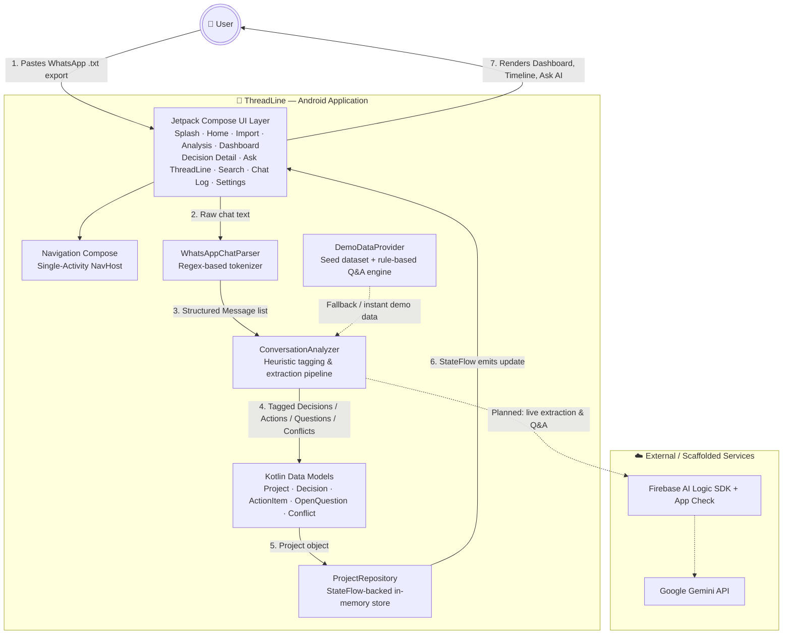
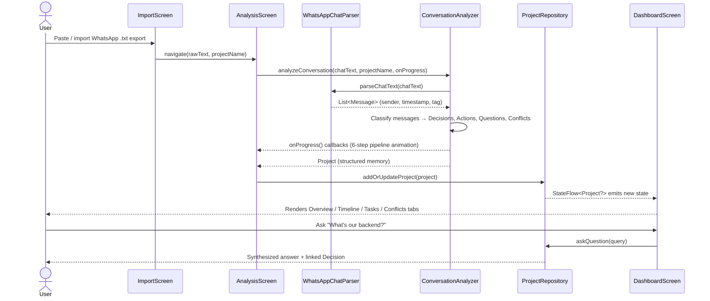
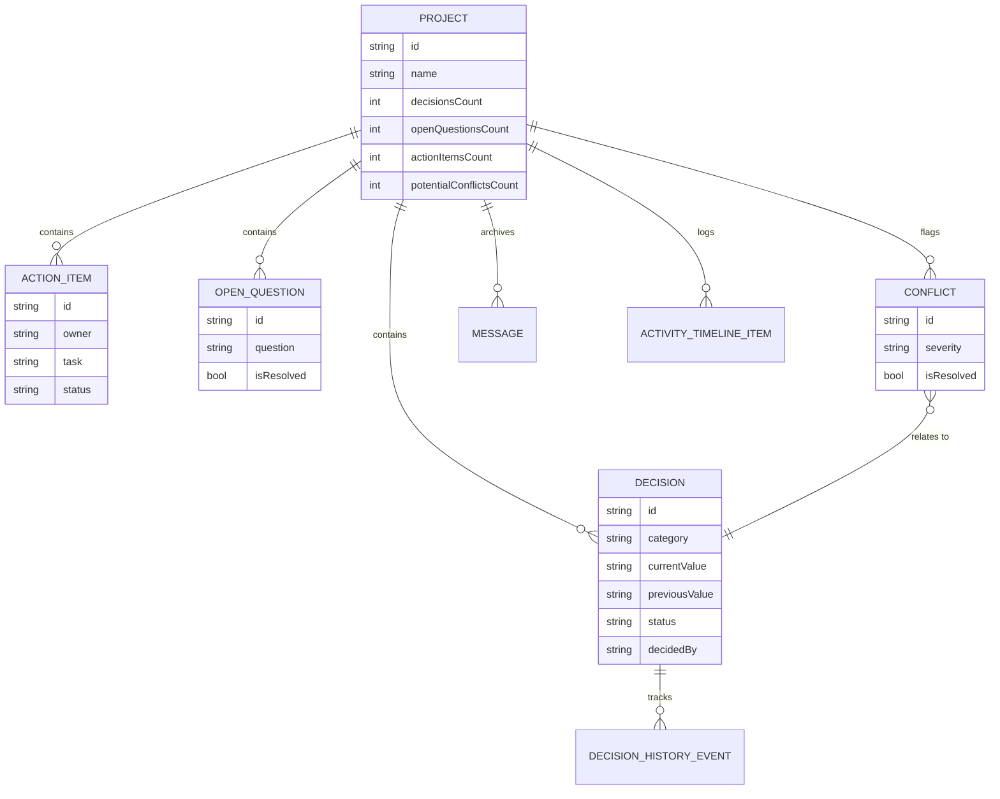

<div align="center">


# 🧵 ThreadLine

### AI-Powered Conversation Intelligence for Hackathon & Student Project Teams

**Turn messy WhatsApp group chats into a structured, searchable project memory — decisions, tasks, conflicts, and answers, automatically.**

[](https://kotlinlang.org)
[](https://developer.android.com/jetpack/compose)
[](https://developer.android.com)
[](https://ai.google.dev)
[](https://firebase.google.com)
[](https://aistudio.google.com)

[](LICENSE)
[](https://github.com/tusharkkp/ThreadLine/stargazers)
[](https://github.com/tusharkkp/ThreadLine/network/members)
[](https://github.com/tusharkkp/ThreadLine/issues)
[](#contributing)

**[Report Bug](https://github.com/tusharkkp/ThreadLine/issues) · [Request Feature](https://github.com/tusharkkp/ThreadLine/issues) · [View Demo Flow](#usage-guide)**

</div>

<br/>

> **ThreadLine** is an open-source **Android app (Kotlin + Jetpack Compose)** that reads exported WhatsApp group chats from hackathon or student project teams and converts them into a structured **decision tracker, action-item board, conflict detector, and AI Q&A assistant** — so nobody has to scroll through 2,000 messages to find "wait, did we agree on Firebase or Supabase?"

If you've ever lost a hackathon's architecture decision in a wall of WhatsApp texts, ThreadLine is for you. ⭐ **Star this repo** if that sounds familiar — it helps other student/hackathon teams discover the project.

---

## 📑 Table of Contents

- [Problem Statement](#problem-statement)
- [Features](#features)
- [Architecture & Workflow](#architecture--workflow)
- [Tech Stack](#tech-stack)
- [Installation Guide](#installation-guide)
- [Environment Variables](#environment-variables)
- [Usage Guide](#usage-guide)
- [API Reference](#api-reference)
- [Folder Structure](#folder-structure)
- [Screenshots & Preview](#screenshots--preview)
- [Performance & Scalability](#performance--scalability)
- [Roadmap & Future Scope](#roadmap--future-scope)
- [Contributing](#contributing)
- [License](#license)
- [Author & Credits](#author--credits)

---

## Problem Statement

Every hackathon, college project, or side-project team runs its entire decision-making process inside **WhatsApp group chats** — an unstructured, unsearchable, chronological flood of messages. This creates a very real, very common problem:

- 🔀 **Decisions get lost.** "Let's use Firebase" at 10 AM quietly becomes "Let's use Supabase" at 4 PM, buried under 300 unrelated messages, and nobody documents *why*.
- 🧟 **Zombie work happens.** A teammate keeps building on the old decision because they never saw the change — wasting hours right before a submission deadline.
- ❓ **Open questions vanish.** "Should auth be Google OAuth or OTP?" gets asked, gets buried, and never gets answered.
- ✅ **Action items are invisible.** "I'll handle the Gradle setup" is a promise with no owner, no deadline, and no tracking once it scrolls off-screen.
- ⚠️ **Conflicts go undetected.** Two people quietly build two different solutions to the same problem because the pivot in the group chat was missed.
- 🕐 **No single source of truth.** New teammates (or judges, or mentors) have no way to quickly understand "what did this team actually decide, and when?"

**ThreadLine solves this** by acting as an **AI-powered project memory layer on top of your existing WhatsApp workflow** — no new chat app to adopt, no behavior change required. Import your chat export once, and ThreadLine automatically extracts:

- A timeline of **decisions**, including what was **superseded and why**
- A list of **action items** with owners and status
- **Open questions** that still need answers
- **Detected conflicts** between what was agreed and what was actually built
- A conversational **"Ask ThreadLine"** assistant you can query in plain English

This makes ThreadLine genuinely useful for **hackathon teams, student capstone projects, open-source contributor groups, and any small team that plans over chat instead of a project management tool.**

---

## Features

### 🧠 AI & Data Intelligence
- **WhatsApp chat import & parsing** — paste or import a raw `.txt` WhatsApp export; a purpose-built parser tokenizes senders, timestamps, and multi-line messages.
- **Automatic message tagging** — every message is classified as a `Decision`, `Decision Update`, `Action Item`, `Open Question`, `Conflict`, or general `Discussion`.
- **Decision history & versioning** — tracks when a decision was made, when it changed, who changed it, and the exact quote that triggered the change.
- **Conflict detection** — flags when work described in chat contradicts the latest confirmed decision (e.g., someone finished a Firebase module *after* the team switched to Supabase).
- **"Ask ThreadLine" AI assistant** — ask natural-language questions like *"What's our current backend?"* or *"What's still pending?"* and get a synthesized, cited answer.
- **Google Gemini integration (via Firebase AI Logic SDK)** — wired into the project for secure, keyless-on-device generative AI calls, ready to power live LLM extraction and Q&A.

### 📱 User-Facing Features
- **Animated multi-step analysis screen** — a transparent, step-by-step "AI is reading your chat" pipeline visualization builds user trust.
- **Project Dashboard** with tabbed views: **Overview, Decisions, Actions, Open Questions, Changes**.
- **Decision Detail screen** — full history timeline, source quotes, confidence level, and one-tap conflict resolution.
- **Global Search** across decisions, action items, and open questions.
- **Raw Chat Log viewer** — jump back to the original message that generated any insight, for full traceability.
- **Multi-project support** — manage more than one hackathon/team chat at a time, switch between them from Home.
- **One-tap Demo Mode** — a fully populated "Smart India Hackathon" sample project so new users can explore the app instantly with zero setup.
- **Project Settings** — re-run analysis on a chat, or delete a project.

### 🛠️ Technical / Developer-Facing Features
- **100% Kotlin, Jetpack Compose, Material 3** — modern, declarative single-Activity UI architecture.
- **Reactive state management** with Kotlin `StateFlow` (unidirectional data flow, no manual UI refresh logic).
- **Modular, swappable analysis engine** — the current heuristic/regex engine is designed to be replaced by a live Gemini pipeline without touching the UI layer.
- **Environment-based secret management** via the Secrets Gradle Plugin (`.env` / `.env.example`), so API keys never get committed.
- **Test-ready scaffolding** — JUnit4, Espresso, Robolectric, and Roborazzi (screenshot testing) already configured.
- **Offline-first foundations** — Room and Moshi dependencies pre-wired for local persistence and JSON modeling.

---

## Architecture & Workflow

ThreadLine is a **client-only Android application** (no custom backend server) built around a simple, testable pipeline: **raw chat text → structured messages → tagged project memory → reactive UI**.

### System Architecture



### Import → Analyze → Track Workflow



### Core Data Model



**Why this design?** Keeping the parsing (`WhatsAppChatParser`), tagging (`ConversationAnalyzer`), and state (`ProjectRepository`) layers fully decoupled from Jetpack Compose means the entire extraction engine can be upgraded — from today's fast, offline heuristic tagger to a full **Gemini-powered LLM pipeline** — without rewriting a single screen.

---

## Tech Stack

### Frontend / UI
| Technology | Why it was used |
|---|---|
| **Kotlin** | Official, modern, null-safe language for Android; concise and coroutine-native. |
| **Jetpack Compose** | Declarative UI reduces boilerplate vs. XML/View system and makes complex, animated screens (like the Analysis pipeline) far easier to build and maintain. |
| **Material 3** | Provides a modern, accessible, dynamically-themeable design system out of the box. |
| **Navigation Compose** | Type-safe, single-Activity navigation graph — ideal for a multi-screen app like ThreadLine's 9-screen flow. |
| **Kotlin Coroutines + Flow / StateFlow** | Enables reactive, unidirectional state updates (repository → UI) without manual observers or callbacks. |

### Data & State Layer
| Technology | Why it was used |
|---|---|
| **Kotlin `object` singletons** (`WhatsAppChatParser`, `ConversationAnalyzer`) | Zero-overhead, stateless processing utilities — ideal for a fast, offline-first hackathon MVP with no backend cost. |
| **`ProjectRepository` (StateFlow)** | A single, reactive source of truth shared across every screen, avoiding prop-drilling and stale UI state. |
| **Moshi** | Type-safe, Kotlin-first JSON parsing — used for (de)serializing structured chat/project data. |

### AI / ML
| Technology | Why it was used |
|---|---|
| **Google Gemini API** | Chosen (per the team's own in-app demo decision log!) for its strong latency-cost trade-off for real-time, on-device-adjacent inference. |
| **Firebase AI Logic SDK** | Gives the Android client secure, direct access to Gemini without hand-rolling key exchange, plus built-in **Firebase App Check** protection against API abuse. |

### Database / Persistence (scaffolded)
| Technology | Why it was used |
|---|---|
| **Room (`androidx.room`)** | Type-safe SQLite ORM, chosen to add offline persistence/caching of parsed chats and project memory as the app matures beyond in-memory state. |
| **DataStore *(planned)*** | For lightweight user preferences (theme, default project, etc.). |

### Networking (scaffolded for future cloud sync)
| Technology | Why it was used |
|---|---|
| **Retrofit + OkHttp** | Industry-standard, well-tested Android HTTP stack — ready for cloud sync or external hackathon-platform integrations. |
| **Moshi Converter** | Pairs Retrofit with the same JSON library used elsewhere in the app for consistency. |

### Deployment / Tooling
| Technology | Why it was used |
|---|---|
| **Google AI Studio** (`google-gemini/aistudio-repository-template`) | The project was scaffolded via AI Studio for rapid, Gemini-ready prototyping — ideal for a hackathon timeline. |
| **Gradle (Kotlin DSL) + AGP 9.1.1** | Modern, type-safe build configuration. |
| **KSP (Kotlin Symbol Processing)** | Fast annotation processing for Room and Moshi codegen. |
| **Secrets Gradle Plugin** | Reads `GEMINI_API_KEY` from a git-ignored `.env` file, keeping secrets out of version control. |
| **JUnit4, Espresso, Robolectric, Roborazzi** | Unit, instrumented, and screenshot-testing coverage from day one. |
| **GitHub** | Source control and issue tracking (GitHub Actions CI recommended — see [Roadmap](#roadmap--future-scope)). |

---

## Installation Guide

### Prerequisites

- **Android Studio** — Ladybug (2024.2) or newer, with Android Gradle Plugin 9.x support
- **JDK 17+**
- **Android SDK** — Platform 36 (compile/target), minimum SDK 24 (Android 7.0 Nougat and above)
- A free **Google AI Studio / Gemini API key** ([get one here](https://aistudio.google.com/apikey)) — only required if you plan to wire up live AI features

### Step-by-Step Setup

```bash
# 1. Clone the repository
git clone https://github.com/tusharkkp/ThreadLine.git
cd ThreadLine

# 2. Open the project in Android Studio
# File → Open → select the cloned "ThreadLine" folder
```

```bash
# 3. Configure your environment variables (see below)
cp .env.example .env
# then edit .env and add your GEMINI_API_KEY
```

4. **Let Gradle sync.** Android Studio will automatically download AGP `9.1.1`, Kotlin `2.2.10`, and all dependencies defined in `gradle/libs.versions.toml`.

5. **(Optional) Firebase setup.** If you want to use Firebase-backed features (App Check, future Auth/Firestore), add your own `google-services.json` to `app/`. The project builds fine without it — `missingGoogleServicesStrategy` is set to `WARN`, not `ERROR`.

6. **Run the app.** Select an emulator or physical device (API 24+) and click **Run ▶** in Android Studio, or from the terminal:

```bash
# Run on a connected device/emulator
./gradlew installDebug
```

### Build Instructions

```bash
# Build a debug APK
./gradlew assembleDebug

# Build a full project (debug + checks)
./gradlew build

# Run unit tests
./gradlew test

# Run instrumented tests (requires a connected device/emulator)
./gradlew connectedAndroidTest
```

The generated APK will be available at `app/build/outputs/apk/debug/app-debug.apk`.

---

## Environment Variables

ThreadLine uses the **Secrets Gradle Plugin** to manage API keys the same way modern web projects handle `.env` files — keeping secrets out of Git while still making them available at build time.

Create a `.env` file in the project root (this file is already git-ignored):

**`.env.example`**
```bash
# GEMINI_API_KEY: Required for Gemini AI API calls.
# This is a placeholder key.
# AI Studio automatically injects this at runtime from user secrets.
# Users configure this via the Secrets panel in the AI Studio UI.
# IMPORTANT: Uncomment the line below if your app uses the Gemini API.
# If left commented out, the key will NOT be packaged in the APK.
# GEMINI_API_KEY=MY_GEMINI_API_KEY
```

| Variable | Required | Description |
|---|---|---|
| `GEMINI_API_KEY` | Optional (for AI features) | Your Google Gemini API key, used via the Firebase AI Logic SDK for generative extraction and Q&A. Get one from [Google AI Studio](https://aistudio.google.com/apikey). Leave commented out to build without packaging any key. |

> ⚠️ **Never commit your real `.env` file.** Only `.env.example` (with placeholder/commented values) should ever be pushed to the repository.

---

## Usage Guide

ThreadLine's flow mirrors how a real team would review its own chat history:

1. **Splash Screen** — tap **Get Started** to set up your own project, or **Try Demo** to instantly load a fully populated sample hackathon project.
2. **Home** — see all your projects, or tap **Import Chat** to bring in a new WhatsApp export.
3. **Import Screen** — paste the contents of an exported WhatsApp `.txt` chat (`More options → Export chat → Without media`), name your project, and start analysis.
4. **Analysis Screen** — watch a transparent, animated 6-step pipeline: *reading messages → identifying decisions → connecting related threads → detecting changes → finding open questions → building project memory.*
5. **Dashboard** — explore your project across five tabs:
   - **Overview** — health snapshot, tech stack summary, recent activity
   - **Decisions** — every confirmed/superseded decision with confidence level
   - **Actions** — task list with owners; tap to mark complete
   - **Open** — unresolved questions the team still needs to answer
   - **Changes** — a timeline of every decision that got overturned, and why
6. **Decision Detail** — drill into any decision to see its full history, the original chat quote, and a **Resolve Conflict** action if one was flagged.
7. **Ask ThreadLine** — type natural-language questions ("What's our current backend?", "What's still pending?") and get a synthesized answer, with follow-up links to the relevant decision.
8. **Search** — instantly filter across all decisions, actions, and open questions.
9. **Chat Log** — view the original raw messages behind any extracted insight for full traceability.
10. **Settings** — re-analyze a project after new chat activity, or delete it.

---

## API Reference

ThreadLine currently ships as a **client-only Android app** — there is no external REST backend. The Gemini/Firebase AI dependency is wired into the project for live generative calls, but the shipped MVP pipeline runs entirely **on-device** using the internal data layer below. Think of this as ThreadLine's "API surface": the public functions the UI layer calls to get its data.

### `WhatsAppChatParser` — `com.example.data`

| Function | Signature | Description |
|---|---|---|
| `parseChatText` | `fun parseChatText(rawText: String): List<Message>` | Tokenizes a raw WhatsApp `.txt` export into structured `Message` objects (sender, timestamp, text, tag), handling multi-line messages and system notices. |

### `ConversationAnalyzer` — `com.example.data`

| Function | Signature | Description |
|---|---|---|
| `analyzeConversation` | `suspend fun analyzeConversation(chatText: String, projectName: String, onProgress: (String, Float) -> Unit): Project` | Runs the full extraction pipeline: parses messages, tags decisions/actions/questions/conflicts, and returns a fully populated `Project`. Emits human-readable progress updates for the Analysis screen's UI animation. |

### `ProjectRepository` — `com.example.data`

| Function | Signature | Description |
|---|---|---|
| `selectProject` | `fun selectProject(projectId: String)` | Sets the active project by ID. |
| `addOrUpdateProject` | `fun addOrUpdateProject(project: Project)` | Inserts a new project or updates an existing one, and makes it active. |
| `deleteProject` | `fun deleteProject(projectId: String)` | Removes a project from the store. |
| `toggleActionItem` | `fun toggleActionItem(actionId: String)` | Flips an action item between `COMPLETED` and `IN_PROGRESS`. |
| `resolveConflict` | `fun resolveConflict(conflictId: String)` | Marks a detected conflict as resolved. |
| `resolveQuestion` | `fun resolveQuestion(questionId: String, note: String = "Resolved by team")` | Marks an open question as resolved with an optional resolution note. |
| `askQuestion` | `fun askQuestion(query: String): String` | Submits a natural-language query to the Q&A engine and returns a synthesized answer, logging it to `qaHistory`. |

Exposed reactive state (all `StateFlow`):

| Stream | Type | Description |
|---|---|---|
| `projects` | `StateFlow<List<Project>>` | All saved projects. |
| `activeProject` | `StateFlow<Project?>` | The currently selected project. |
| `qaHistory` | `StateFlow<List<ChatQaMessage>>` | Full "Ask ThreadLine" conversation history. |

> **Roadmap:** these same function signatures are designed to remain stable when `ConversationAnalyzer` and `askQuestion` are upgraded to call the live **Gemini API** instead of the current heuristic engine — see [Roadmap & Future Scope](#roadmap--future-scope).

---

## Folder Structure

```
ThreadLine/
├── app/
│   ├── src/
│   │   ├── main/
│   │   │   ├── java/com/example/
│   │   │   │   ├── MainActivity.kt            # Single-Activity entry point
│   │   │   │   ├── data/                      # Data & processing layer
│   │   │   │   │   ├── WhatsAppChatParser.kt   # Raw .txt → structured Message list
│   │   │   │   │   ├── ConversationAnalyzer.kt # Message tagging & Project extraction pipeline
│   │   │   │   │   ├── ProjectRepository.kt    # StateFlow-backed single source of truth
│   │   │   │   │   └── DemoDataProvider.kt     # Seed dataset + rule-based Q&A engine
│   │   │   │   ├── model/                      # Kotlin data classes (domain model)
│   │   │   │   │   ├── Project.kt
│   │   │   │   │   ├── Decision.kt
│   │   │   │   │   ├── DecisionHistoryEvent.kt
│   │   │   │   │   ├── DecisionChange.kt
│   │   │   │   │   ├── ActionItem.kt
│   │   │   │   │   ├── OpenQuestion.kt
│   │   │   │   │   ├── Conflict.kt
│   │   │   │   │   └── Message.kt
│   │   │   │   └── ui/
│   │   │   │       ├── navigation/
│   │   │   │       │   └── AppNavigation.kt    # NavHost + route definitions
│   │   │   │       ├── screens/                # One file per app screen (9 screens)
│   │   │   │       │   ├── SplashScreen.kt
│   │   │   │       │   ├── HomeScreen.kt
│   │   │   │       │   ├── ImportScreen.kt
│   │   │   │       │   ├── AnalysisScreen.kt
│   │   │   │       │   ├── DashboardScreen.kt
│   │   │   │       │   ├── DecisionDetailScreen.kt
│   │   │   │       │   ├── AskThreadlineScreen.kt
│   │   │   │       │   ├── SearchScreen.kt
│   │   │   │       │   ├── ChatLogScreen.kt
│   │   │   │       │   └── ProjectSettingsScreen.kt
│   │   │   │       ├── components/             # Reusable Compose UI pieces
│   │   │   │       │   ├── DecisionCard.kt
│   │   │   │       │   ├── ActionItemCard.kt
│   │   │   │       │   ├── OpenQuestionCard.kt
│   │   │   │       │   ├── ConflictAlertCard.kt
│   │   │   │       │   ├── ChangeCard.kt
│   │   │   │       │   ├── DecisionTimeline.kt
│   │   │   │       │   ├── StatusBadges.kt
│   │   │   │       │   └── TechStackSummaryCard.kt
│   │   │   │       └── theme/                  # Material 3 color/type/theme setup
│   │   │   ├── res/                            # Android resources (icons, strings, XML)
│   │   │   └── AndroidManifest.xml
│   │   ├── test/                               # Unit + Robolectric/Roborazzi tests
│   │   └── androidTest/                        # Instrumented (on-device) tests
│   ├── build.gradle.kts                        # App-module build config
│   └── proguard-rules.pro
├── gradle/
│   └── libs.versions.toml                      # Centralized dependency version catalog
├── assets/.aistudio/                           # Google AI Studio project metadata
├── build.gradle.kts                            # Root build config
├── settings.gradle.kts
├── metadata.json                               # AI Studio app metadata
├── .env.example                                # Documented environment variable template
└── README.md
```

---

## Screenshots & Preview

The repository doesn't yet include in-app screenshots — contributions here are very welcome! 🙌 If you're adding screenshots, please save them to `docs/screenshots/` using descriptive, SEO-friendly filenames like the ones below, then reference them in this section:

| Screen | Suggested filename |
|---|---|
| Splash / onboarding | `docs/screenshots/threadline-android-app-splash-screen.png` |
| Home / project list | `docs/screenshots/threadline-home-project-list.png` |
| WhatsApp chat import | `docs/screenshots/threadline-whatsapp-chat-import-screen.png` |
| AI analysis pipeline | `docs/screenshots/threadline-ai-analysis-progress-screen.png` |
| Dashboard overview | `docs/screenshots/threadline-dashboard-overview-tab.png` |
| Decision timeline / history | `docs/screenshots/threadline-decision-history-timeline.png` |
| Ask ThreadLine AI chat | `docs/screenshots/threadline-ask-ai-chat-assistant.png` |
| Conflict detection alert | `docs/screenshots/threadline-conflict-detection-alert.png` |

```md
<!-- Example embed once screenshots are added -->
<p align="center">
  
  
  
</p>
```

---

## Performance & Scalability

- **Decoupled pipeline architecture.** `WhatsAppChatParser`, `ConversationAnalyzer`, and `ProjectRepository` have no dependency on the UI layer, so the extraction engine can be swapped (e.g., regex heuristics → Gemini function-calling) without touching a single Composable.
- **Reactive, granular state.** `StateFlow` ensures Compose only recomposes the parts of the UI actually affected by a state change, instead of full-screen redraws.
- **Efficient list rendering.** `LazyColumn`/`LazyRow` are used throughout the Dashboard, Search, and Chat Log screens so large chat imports (thousands of messages) don't block the main thread.
- **Modular growth path.** The current single-module app is structured (by package: `data`, `model`, `ui.screens`, `ui.components`, `ui.navigation`) so it can be split into Gradle feature modules (`:core`, `:data`, `:feature-dashboard`, `:feature-ask-ai`, etc.) as the codebase grows — reducing build times and enabling parallel team development.
- **Offline-first foundation.** Room and Moshi are already declared dependencies, ready to persist parsed projects locally so re-opening the app doesn't require re-importing a chat.
- **Planned pagination.** For very large chat exports (10,000+ messages), the roadmap includes chunked/background parsing via `WorkManager` to keep the UI thread free.

---

## Roadmap & Future Scope

- [ ] **Live Gemini-powered extraction** — replace the current heuristic tagger with Gemini function-calling for higher-accuracy decision/action/conflict detection.
- [ ] **Smarter "Ask ThreadLine"** — move from keyword-matched canned answers to true retrieval-augmented generation over the full chat + decision history.
- [ ] **Multi-platform chat import** — support Slack, Discord, and Telegram exports, not just WhatsApp.
- [ ] **Cloud sync & multi-device** — Firebase Firestore + Auth so a project's memory is shared live across every teammate's device.
- [ ] **Team collaboration mode** — multiple users contributing to and querying the same live project memory.
- [ ] **Push notifications** — alert the team the moment a new conflict or decision reversal is detected.
- [ ] **Exportable reports** — one-tap export of the decision log and action items to PDF/Markdown for hackathon submissions or retrospectives.
- [ ] **On-device Gemini Nano (AICore)** — fully offline, privacy-first inference for sensitive team conversations.
- [ ] **Home-screen widget** — glanceable open tasks and unresolved conflicts.
- [ ] **CI/CD pipeline** — GitHub Actions for automated build, test, and (eventually) Play Store release.
- [ ] **Gradle multi-module refactor** — split into `:core`, `:data`, and `:feature-*` modules for faster builds as the app scales.

Have an idea that's not listed here? [Open a feature request](https://github.com/tusharkkp/ThreadLine/issues) — this roadmap is community-driven.

---

## Contributing

Contributions are what make the open-source community such an amazing place to learn and build — **all contributions are welcome**, from a typo fix to a full new feature.

### How to Contribute

1. **Fork** the repository
2. **Clone** your fork: `git clone https://github.com/<your-username>/ThreadLine.git`
3. **Create a feature branch**: `git checkout -b feature/amazing-feature`
4. **Make your changes** and follow the existing Kotlin/Compose code style
5. **Commit** using a clear, conventional message: `git commit -m "feat: add conflict-severity filter to Search screen"`
6. **Push** to your fork: `git push origin feature/amazing-feature`
7. **Open a Pull Request** against `main` with a clear description of what changed and why

### Guidelines

- Keep PRs focused — one feature/fix per PR is easier to review and merge.
- Match existing naming conventions (`PascalCase` for Composables/classes, `camelCase` for functions/variables).
- Add/update tests where relevant (`app/src/test`, `app/src/androidTest`).
- For UI changes, consider attaching before/after screenshots to your PR.
- Check open [Issues](https://github.com/tusharkkp/ThreadLine/issues) — issues labeled `good first issue` are a great place to start.
- Be respectful and constructive in code reviews and discussions.

### Reporting Issues

Found a bug or have a feature idea? [Open an issue](https://github.com/tusharkkp/ThreadLine/issues/new) and include:
- Steps to reproduce (for bugs)
- Expected vs. actual behavior
- Device/Android version, if relevant
- Screenshots or logs, if applicable

---

## License

This project is licensed under the **MIT License**.

A `LICENSE` file is included in this repository — see [`LICENSE`](LICENSE) for the full text. In short: you're free to use, modify, and distribute this project, including commercially, as long as the original copyright notice is retained.

---

## Author & Credits

**ThreadLine** was built by:

<div align="left">

**Tushar Kaldate**
[](https://github.com/tusharkkp)
[](https://www.linkedin.com/in/tushar-kaldate-2b5276262/)

</div>

Originally built as a prototype for the **IQOO Hackathon**, and scaffolded from Google's [`aistudio-repository-template`](https://github.com/google-gemini/aistudio-repository-template).

### Acknowledgments

- [Google AI Studio](https://aistudio.google.com) — rapid prototyping environment this project was generated from
- [Firebase](https://firebase.google.com) — AI Logic SDK, App Check
- [Google Gemini](https://ai.google.dev) — the generative AI model powering ThreadLine's planned live intelligence features
- [Jetpack Compose](https://developer.android.com/jetpack/compose) — Android's modern UI toolkit
- Every contributor who opens an issue, submits a PR, or stars this repo 🙏

---

<div align="center">

### ⭐ If ThreadLine saved your team from a "wait, what did we decide?" moment, consider giving it a star!

[](https://star-history.com/#tusharkkp/ThreadLine&Date)

**[⬆ Back to top](#-threadline)**

</div>
